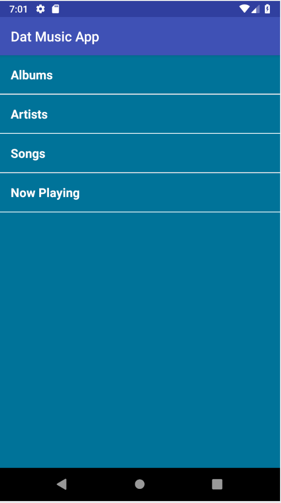

# Musical Structure
Musical Structure App for Android Basics Nanodegree Program  
**Author**: Earl Jay Caoile  
**Version**: 1.0.0

## Overview
This Android app demonstrates the use of arraylists and intents to dynamically display pages for info on a list of songs.

## Getting Started
The following is required to run the program.
1. Android Studio or any IDE that supports Android software development (XML and Java)
2. Java JDK
3. A working emulator or Android phone to use the app

## Example

## Happy Path
 - open application in Android Studio
 - start app by pressing green play button
 - click each menu category
 - look at text
 - close app and smile

## Architecture
This application was created using Android Studio 3.1.4  
*Languages*: XML and Java  
*Type of Applicaiton*: Android Application  

## Credits
Tutorial provided by Udacity's Android Basics Nanodegree Program.

Research on how to get random element from an ArrayList: https://stackoverflow.com/questions/12487592/randomly-select-an-item-from-a-list